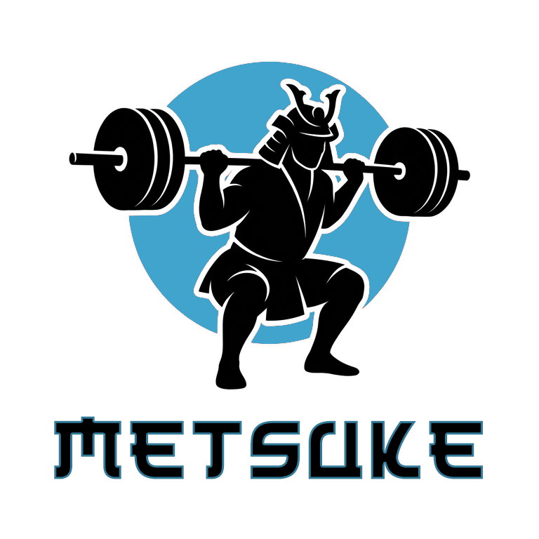
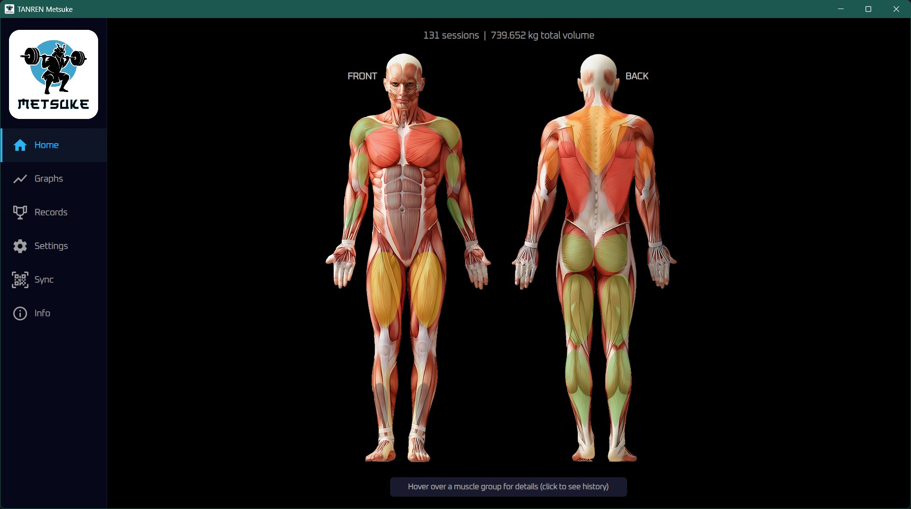
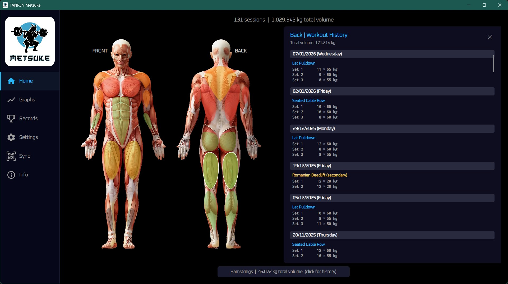
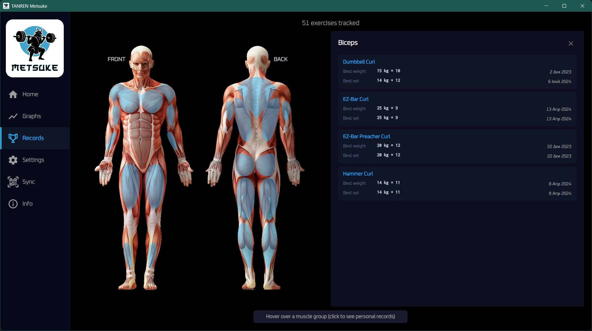
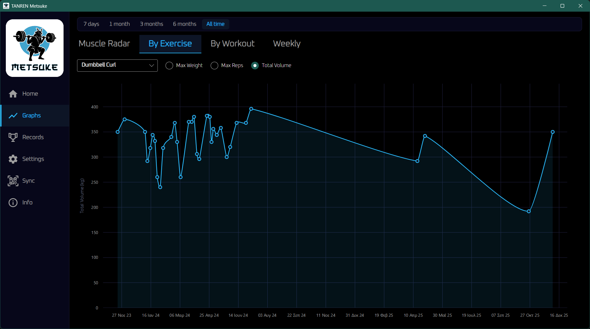
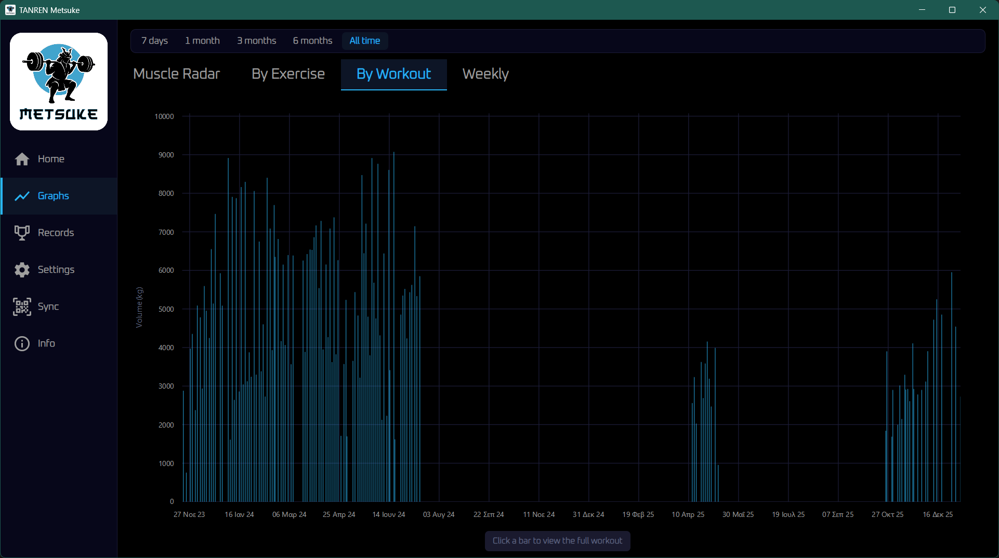
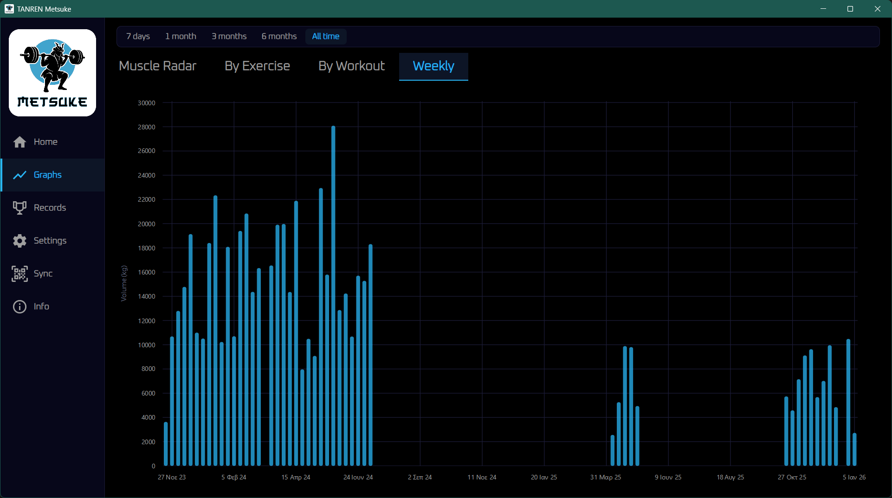
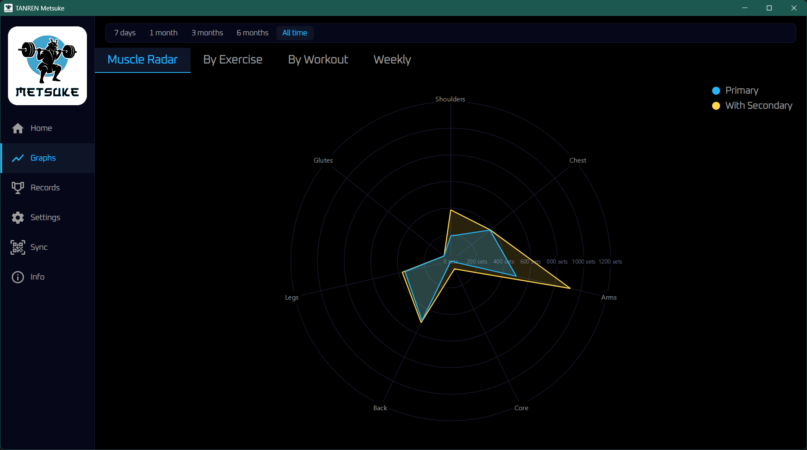

# TANREN Metsuke

**TANREN** (鍛錬) is a Japanese concept meaning the forging and tempering of metal, the repeated, deliberate process that turns raw material into something refined. Applied to training, it describes what happens when you show up consistently, lift with awareness, and build on what came before. Not motivation. Not inspiration. Work, recorded and repeated.

**Metsuke** (目付) means gaze, or the direction of the eye. In budo, it refers to the kind of focused awareness that sees everything without fixating on any single point. This app is the eye on your training history.

---

## What it does

TANREN Metsuke is a Windows desktop app that reads workout data recorded by [TANREN Kiroku](https://github.com/kar-dim/TANREN-Kiroku) and turns it into charts, records, and a muscle heat map. No accounts, no cloud, no subscriptions.

- **Home dashboard:** total workouts and lifetime volume at a glance, with an interactive body map colored by training volume per muscle group. Click any muscle region to open a history panel for that group
- **By Exercise chart:** track max weight, max reps, or total volume over time for any exercise in your history
- **By Workout chart:** bar chart of session volume across your timeline; click any bar to read the full workout breakdown
- **Weekly chart:** aggregated volume per calendar week, showing training density over time
- **Muscle Radar:** spider chart of set distribution across major muscle groups, with an optional secondary-muscle overlay to see full stimulus coverage
- **Records:** personal bests per exercise, heaviest set, most reps, highest single-session volume
- **Sync:** pair with TANREN Kiroku over local Wi-Fi via QR code. Transfer is TLS-encrypted and requires no internet connection
- **Unit support:** switch between kg and lbs at any time
- **Secondary muscle weight:** adjust how much secondary muscles contribute to volume calculations

## Screenshots

  

  

  

  

  

  

  

## Companion app

[TANREN Kiroku](https://github.com/kar-dim/TANREN-Kiroku) is the Android companion app for logging workouts. Kiroku (記録) means record, or documentation. It is where each session is entered, set by set.

Sync is done locally over your network: Metsuke shows a QR code, scan it with Kiroku, and the transfer happens directly between phone and desktop. No internet required, no intermediary.

## Requirements

- Windows 10 or later (x64)
- [.NET 9 Desktop Runtime](https://dotnet.microsoft.com/download/dotnet/9.0)

## Data

All data is stored locally as plain JSON files. No cloud, no account required. You own your data and can back it up, transfer it, or inspect it at any time.
