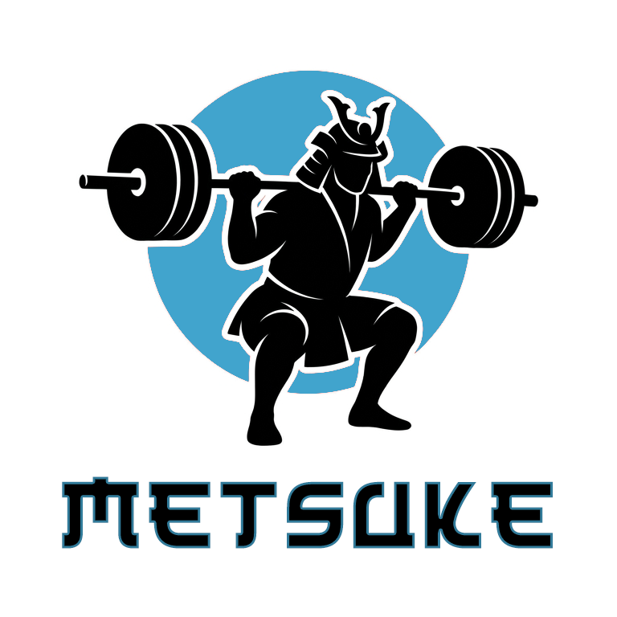
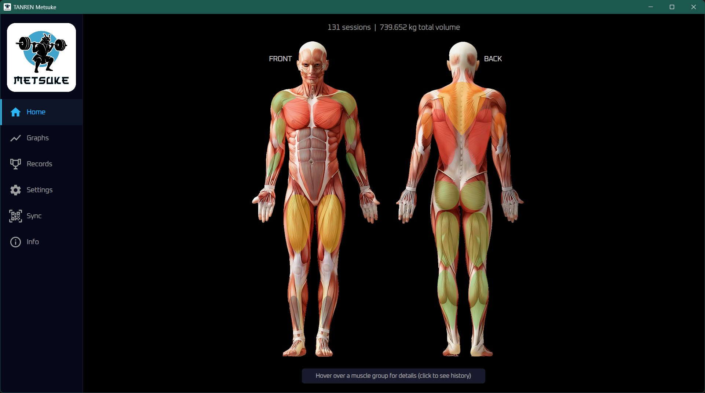
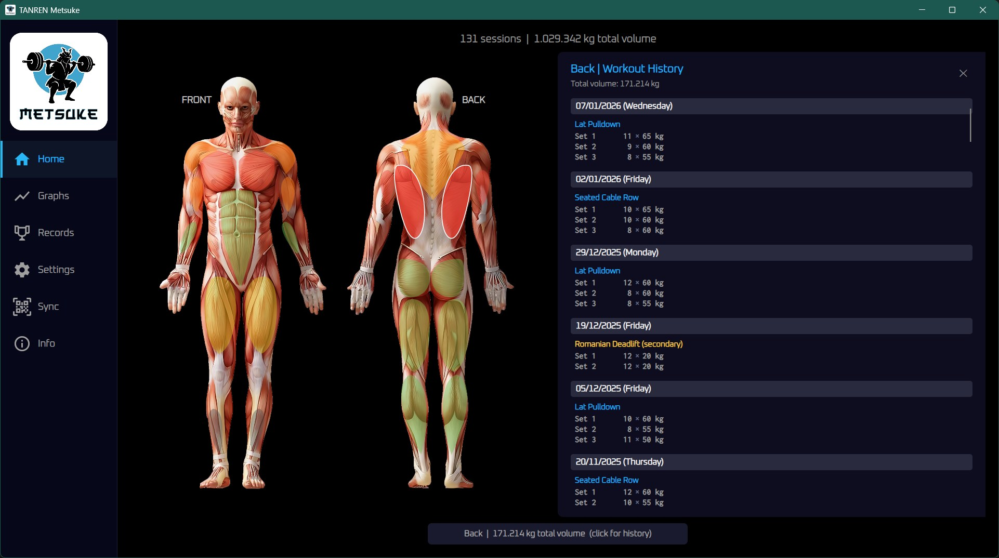
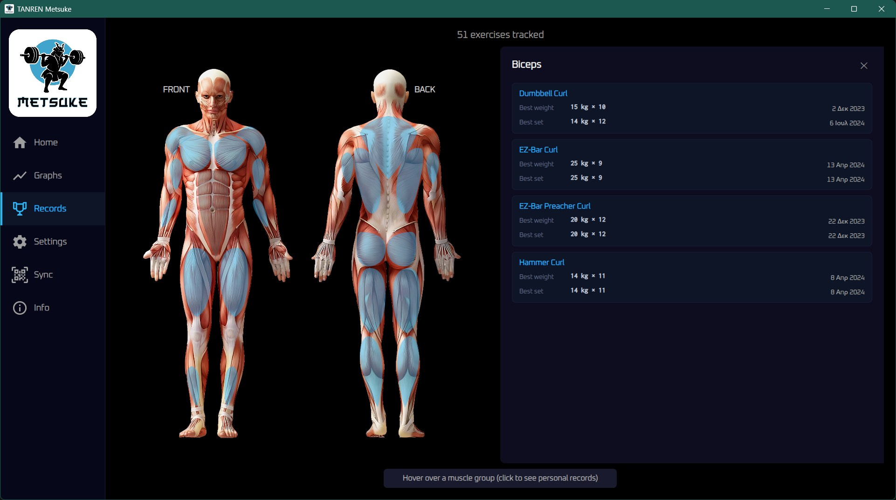
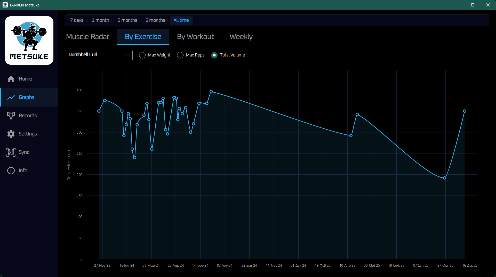
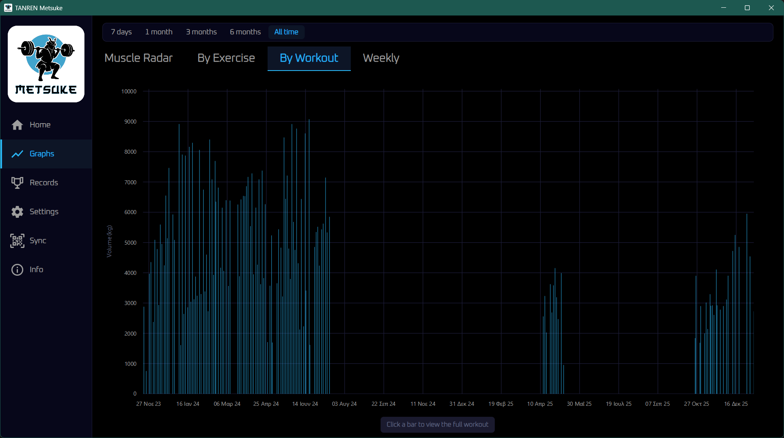
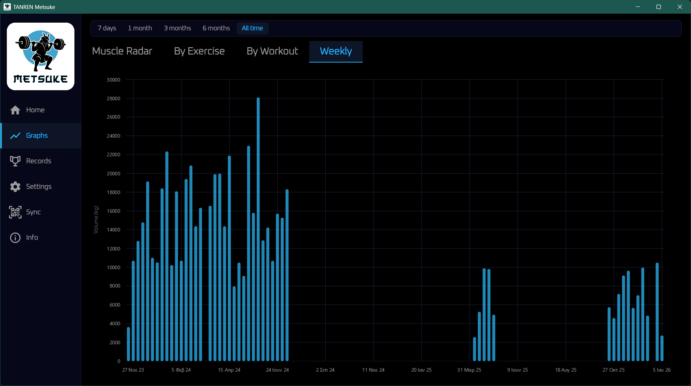
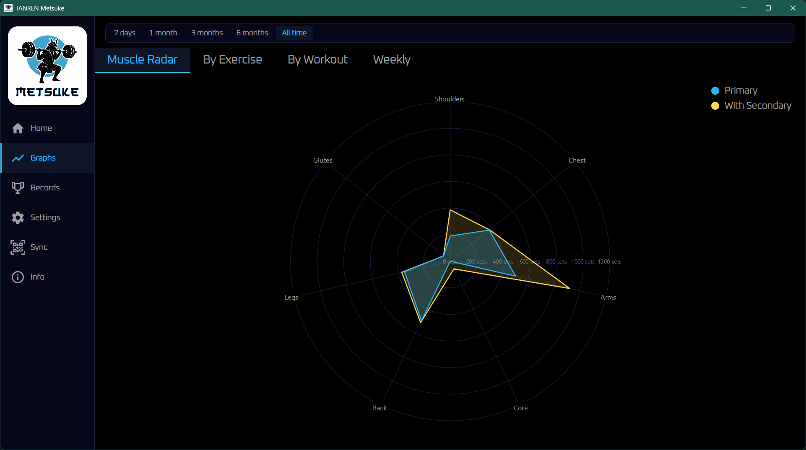
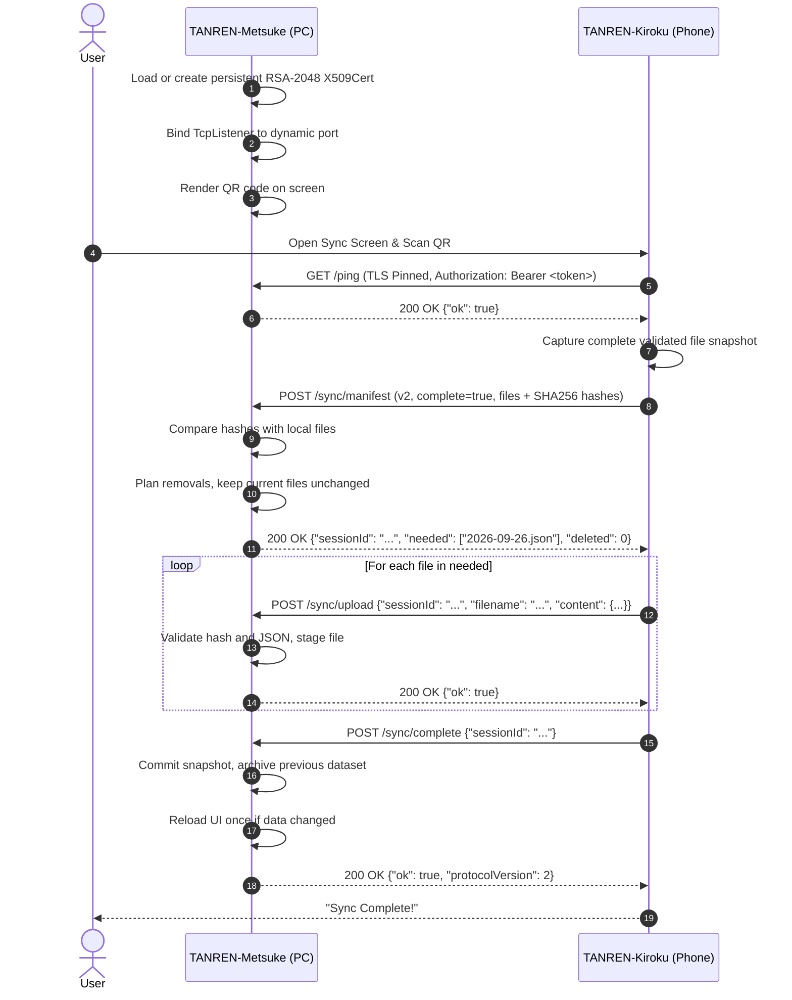

# TANREN Metsuke

**TANREN** (鍛錬) is a Japanese concept meaning the forging and tempering of metal, the repeated, deliberate process that turns raw material into something refined. Applied to training, it describes what happens when you show up consistently, lift with awareness, and build on what came before. Not motivation. Not inspiration. Work, recorded and repeated.

**Metsuke** (目付) means gaze, or the direction of the eye. In budo, it refers to the kind of focused awareness that sees everything without fixating on any single point. This app is the eye on your training history.

---

## What it does

TANREN Metsuke is a simple Windows desktop app that reads workout data recorded by [TANREN Kiroku](https://github.com/kar-dim/TANREN-Kiroku) and turns it into charts, records, and a muscle heat map.

- **Home dashboard:** Total workouts and lifetime volume at a glance, with an interactive body map colored by training volume per muscle group. Click any muscle region to open a history panel for that group
- **By Exercise chart:** Track max weight, max reps, or total volume over time for any exercise in your history
- **By Workout chart:** Bar chart of session volume across your timeline, click any bar to read the full workout breakdown
- **Weekly chart:** Aggregated volume per calendar week, showing training density over time
- **Muscle Radar:** Spider chart of set distribution across major muscle groups, with an optional secondary muscle overlay to see full stimulus coverage
- **Records:** Personal bests per exercise: heaviest recorded load, best set load volume, most reps, and highest single session load volume. Sets with no added weight have rep records too
- **Sync:** Pair with TANREN Kiroku over local Wi-Fi via QR code. Transfer is TLS-encrypted and requires no internet connection (local network only)
- **Unit support:** Switch between kg and lbs at any time
- **Secondary muscle weight:** Adjust how much secondary muscles contribute to volume calculations

## Screenshots

  

  

  

  

  

  

  

## Companion app

[TANREN Kiroku](https://github.com/kar-dim/TANREN-Kiroku) is the Android companion app for logging workouts. Kiroku (記録) means record, or documentation. It is where each session is entered, set by set.

Sync is done locally over your network: Metsuke shows a QR code, scan it with Kiroku, and the transfer happens directly between phone and desktop. No internet is required. Select the LAN adapter and refresh the connection if your network changes.

## Desktop–Mobile Sync Protocol Specification

Synchronization occurs strictly over the local network (Wi-Fi):

```mermaid
sequenceDiagram
    autonumber
    actor User
    participant Desktop as TANREN-Metsuke (PC)
    participant Mobile as TANREN-Kiroku (Phone)

    Desktop->>Desktop: Load or create persistent RSA-2048 X509Cert
    Desktop->>Desktop: Bind TcpListener to dynamic port
    Desktop->>Desktop: Render QR code on screen
    User->>Mobile: Open Sync Screen & Scan QR
    Mobile->>Desktop: GET /ping (TLS Pinned, Authorization: Bearer <token>)
    Desktop-->>Mobile: 200 OK {"ok": true}
    Mobile->>Mobile: Capture complete validated file snapshot
    Mobile->>Desktop: POST /sync/manifest (v2, complete=true, files + SHA256 hashes)
    Desktop->>Desktop: Compare hashes with local files
    Desktop->>Desktop: Plan removals, keep current files unchanged
    Desktop-->>Mobile: 200 OK {"sessionId": "...", "needed": ["2026-09-26.json"], "deleted": 0}
    loop For each file in needed
        Mobile->>Desktop: POST /sync/upload {"sessionId": "...", "filename": "...", "content": {...}}
        Desktop->>Desktop: Validate hash and JSON, stage file
        Desktop-->>Mobile: 200 OK {"ok": true}
    end
    Mobile->>Desktop: POST /sync/complete {"sessionId": "..."}
    Desktop->>Desktop: Commit snapshot, archive previous dataset
    Desktop->>Desktop: Reload UI once if data changed
    Desktop-->>Mobile: 200 OK {"ok": true, "protocolVersion": 2}
    Mobile-->>User: "Sync Complete!"
```

## Requirements

- Windows 10 or later (x64)
- [.NET 10 Runtime](https://dotnet.microsoft.com/download/dotnet/10.0) for framework-dependent builds (self-contained builds include it)

## Data

All data is stored locally as plain JSON files. No cloud, no account required. You own your data and can back it up, transfer it, or inspect it at any time.

Workouts live in `%APPDATA%/TANREN/workouts/`. Each changed sync retains the previous complete dataset in `%APPDATA%/TANREN/sync-backups/`. These copies are local recovery snapshots, not a substitute for an independent phone backup. Interrupted directory swaps are recovered on startup. Invalid local workout files are skipped with a visible warning.

Weights are stored in kg. Zero means no recorded extra load: these sets count toward rep records and radar set distribution, but contribute zero to recorded load volume and the volume heat map. The app does not infer body weight or effective resistance.